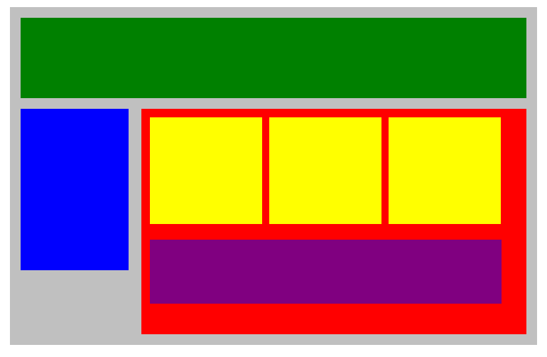

# wf_plotting_our_blocks

Use **margins** and **paddings** to adjust the spaces between divisions and use the **display** property to be able to put each block in its proper place. We may need additional CSS properties.



- html starter code:

```html
<!DOCTYPE html>
<html lang="en">
<head>
    <title>Position Practice</title>
    <link rel="stylesheet" type="text/css" href="style.css">
</head>
<body>
    <div class="container">
        <div class="top-nav"></div>
        <div class="side-nav"></div>
        <div class="main">
            <div class="sub-content"></div>
            <div class="sub-content"></div>
            <div class="sub-content"></div>
            <div id="advertisement"></div>
        </div>
    </div>
</body>
</html>
```

CSS starter code:

```css
.container{
    width: 950px;
    background-color: silver;
    margin: 0 auto;
}
.top-nav {
    height: 150px;
    background-color: green;
}
.side-nav {
    height: 300px;
    width: 200px;
    background-color: blue;
}
.main {
    height: 400px;
    width: 700px;
    background-color: red;
}
.sub-content {
    height: 200px;
    width: 210px;
    background-color: yellow;
}
#advertisement {
    height: 120px;
    width: 660px;
    background-color: purple;
}


```


While we do this assignment, we can make use `height` as well as the `vertical-align` property to give the necessary height to the division and also to vertically align some of the inline-blocks.